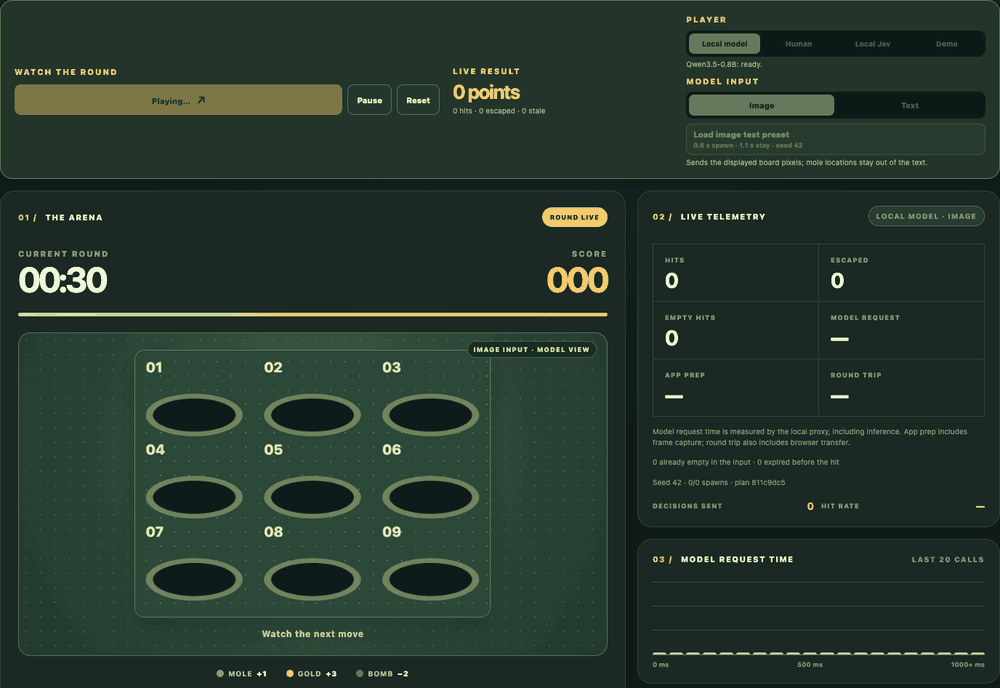
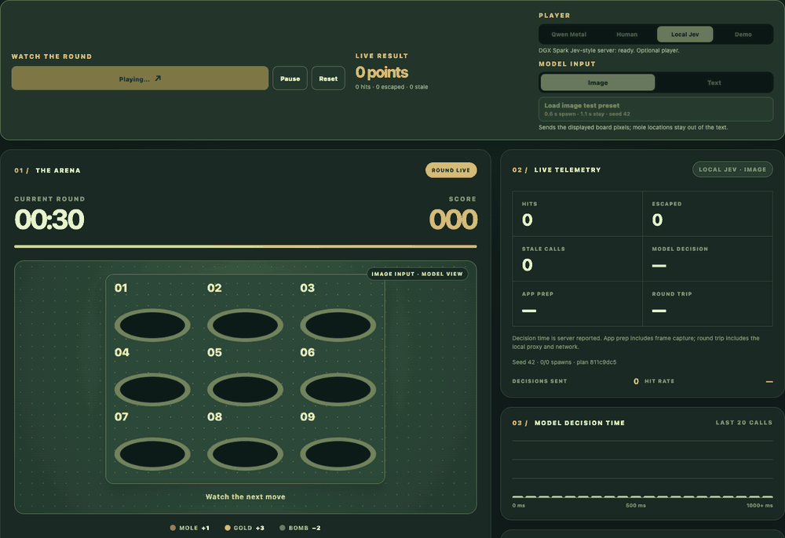

# Mole Lab: Whack-a-Mole for local models

**Can a local model keep up with Whack-a-Mole?** The game rewards fast, accurate choices. Larger models may choose better but answer too late; smaller models may answer sooner and miss. Live image input puts multimodal latency on the clock, with Text as a baseline. Play the same seeded round yourself.

<p align="center"></p>

## Play on Vercel

Open **[mole-lab.vercel.app](https://mole-lab.vercel.app)** in Chrome. The page has setup steps for both model backends and a link to this repository. **Human** and **Demo** work immediately. For model play, start a local or LAN server and click **Connect**. Chrome may ask for local network access. The board image or text state goes from your browser to your model server or local Jev bridge; Vercel does not proxy inference.

For the default Qwen image and text player, install [vLLM-metal](https://docs.vllm.ai/projects/vllm-metal/en/latest/installation/) on an Apple Silicon Mac with Homebrew:

```sh
brew tap vllm-project/vllm-metal https://github.com/vllm-project/vllm-metal
brew install vllm-project/vllm-metal/vllm-metal
```

Then launch the server:

```sh
VLLM_METAL_MULTIMODAL_MODE=multimodal-native \
VLLM_ENABLE_V1_MULTIPROCESSING=0 \
vllm serve Qwen/Qwen3.5-0.8B \
  --max-model-len 2048 \
  --max-num-seqs 1 --gpu-memory-utilization 0.35 \
  --host 127.0.0.1 --port 8012
```

Paged attention is enabled by default in vLLM-metal. The site expects `http://127.0.0.1:8012` and uses the standard served ID `Qwen/Qwen3.5-0.8B` from that command. Click **Connect**, allow Chrome's prompt, then start the image round. If your server exposes one model under a different ID, the page discovers and selects that ID from `/v1/models`.

To use another served model, expand **Change model or server** on the first screen and enter its base URL. **Connect** reads `/v1/models` and fills in the ID when the server has one model; choose from the list if it serves several. The URL and model ID are saved in your browser; an optional bearer key is kept only in the current tab. Choose **Text** for text-only models. Image play requires a vision model, and decision requests require a vLLM-compatible `structured_outputs.choice` endpoint. Custom model connections use browser-direct timing.

For **Local Jev**, run a DGX Spark Jev server such as the [djev-spark recipe](https://github.com/mmastrac/djev-spark). That recipe serves Jev on port 8011 but does not provide browser CORS headers. Run the bridge on the computer where you open Chrome, replacing the example address with your Spark's LAN IP:

```sh
JEV_BASE_URL=http://192.168.1.42:8011 npm run bridge
```

Then select **Local Jev** and click **Connect**. Its default URL is `http://127.0.0.1:8013`. The bridge binds only to loopback, accepts the production site's origin, and forwards `/health` and `/v1/systemone` to the Spark. Set `BRIDGE_ALLOWED_ORIGIN` to the HTTPS origin if you host your own copy. If your Jev server already supports browser CORS, you can enter its URL in **Connect DGX Spark** and skip the bridge. Jev image input uses the recipe's `images` extension. The Jev endpoint reports decision time, and the game separately measures the browser round trip. An optional bearer key can be set with `JEV_API_KEY` on the bridge, or in the page for a direct connection; page keys stay in the current tab.

## Run from source

The local game needs Node.js 24 or newer:

```sh
npm start
```

Open [http://127.0.0.1:4173](http://127.0.0.1:4173). With the default settings, its Node proxy connects to Qwen at `http://127.0.0.1:8012`; changing the model or URL in the page switches that model to browser-direct requests. For proxy configuration, copy `.env.example` to `.env` and set `METAL_BASE_URL`, `METAL_MODEL`, or `METAL_API_KEY`.

For the local Node proxy path, set `JEV_BASE_URL` in `.env` to a server accepting `POST /v1/systemone`. `JEV_API_KEY` adds a bearer token when required. Changing the Jev URL in the page switches that player to browser-direct requests.

## Play and compare

| Player | What happens |
| --- | --- |
| **Local model** (default) | The model chooses `h1`–`h9` or `wait`. Image input is selected by default; Text sends occupants and remaining lifetimes. |
| **Human** | Click a hole or press `1`–`9`. Score, escaped moles, empty swings, and spawn-to-click reaction time appear live. |
| **Local Jev** | The optional DGX Spark DiffusionGemma server chooses through Jev's structured API. On Vercel, use the local bridge or a Jev server with CORS support. |
| **Demo** | A scripted browser player previews the game without inference. |

The default round lasts 30 seconds. A mole appears every 600 ms and stays for 1,100 ms. Brown moles score +1, gold moles +3, and bombs −2. The arena chart counts mole hits, gold hits, empty whacks, bomb hits, and waits; escaped moles appear in telemetry. **Load image test preset** restores those settings and seed `42`. Use the same seed and pressure controls to compare scores; the spawn-plan checksum appears beside the live statistics. **Replay round** restarts the selected player with the same settings.

### DGX Spark replay

<p align="center"></p>

## Timing and results

For browser-direct play, **Model request** is measured in the browser through the local API response. With the local Node proxy, it includes the proxy's request to the model. Jev's **Model decision** is reported by its server. **App prep** includes image capture and request preparation; **Round trip** includes browser transfer. These are different timing boundaries, so compare like with like.

**Empty hits** are split into choices that were already empty in the input and targets that expired before the hit. See the [benchmark notes](docs/benchmarks.md) for single-round scores and the image prompt investigation.

## Credits

The browser game adapts Gerard Bentley's [MIT-licensed Whack-a-Mole](https://github.com/gerardrbentley/typescript-mini-games/tree/f699ae39ef755b156daaa7310091ccaf93a3bbbe/whack-a-mole); its license is preserved in [ORIGINAL_LICENSE.txt](ORIGINAL_LICENSE.txt). The optional Jev API follows [vLLM's structured reads PR](https://github.com/vllm-project/vllm/pull/57250) and the [DGX Spark recipe](https://github.com/mmastrac/djev-spark).
