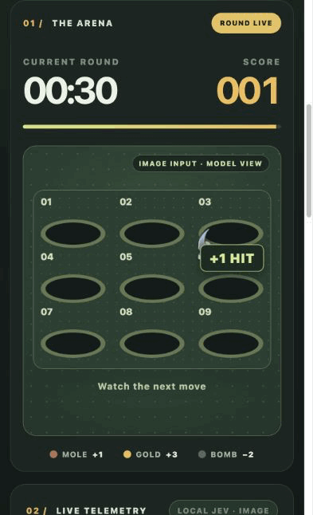

# Mole Lab

Watch **Local Jev** play whack-a-mole. The browser shows every decision, hammer strike, score change, missed mole, and response time as the round runs.



The default round uses **image input**: a mole appears every 600 ms and stays for 1,100 ms. Start and replay are at the top of the page. Switch to text input to compare the same seeded spawn plan.

## Quick start

Requires Node.js 24 or newer and a Jev-style decision server that accepts `POST /v1/systemone`. The image mode uses that endpoint's `images` extension. No package installation is needed.

```sh
cp .env.example .env
# Set JEV_BASE_URL in .env to your decision server.
npm start
```

Open [http://127.0.0.1:4173](http://127.0.0.1:4173). The game server listens on loopback and forwards model requests to `JEV_BASE_URL`. Its default is `http://127.0.0.1:8011`; `JEV_API_KEY` adds an optional bearer token, and `PORT` changes the game server port. **Demo bot** lets you preview the UI without a model server.

## How it works

Each decision is a bounded choice among holes `1`–`9` and `wait`:

- **Image input** sends the exact 600×450 canvas shown in the arena. The text accompanying it explains the scoring rules and hole numbering, but does not reveal mole locations.
- **Text input** sends the nine occupants and their remaining lifetimes as structured state.

Moles score +1, gold moles +3, and bombs −2. The board keeps moving while a request is in flight, so a correct choice can arrive too late. The top action becomes **Replay round** after the clock ends. A fixed seed and the displayed spawn-plan checksum make paired text/image rounds reproducible.

The timing panel keeps three costs separate: **Model decision** is the structured server's reported `diagnostics.timing.total_ms`; **App prep** includes state or image capture and JSON preparation; **Round trip** includes the browser, local proxy, network, and decision server. Model decision is a service-side time, not a pure GPU kernel measurement.

See [benchmark notes](docs/benchmarks.md) for matched text/image results and the image deadline sweep. The **Load image test preset** button restores the 600 ms / 1,100 ms profile with seed `42`.

## Credits

The browser game adapts Gerard Bentley's [MIT-licensed Whack-a-Mole](https://github.com/gerardrbentley/typescript-mini-games/tree/f699ae39ef755b156daaa7310091ccaf93a3bbbe/whack-a-mole); its license is preserved in [ORIGINAL_LICENSE.txt](ORIGINAL_LICENSE.txt). The local decision API follows [vLLM's structured reads PR](https://github.com/vllm-project/vllm/pull/57250) and the [DGX Spark recipe](https://github.com/mmastrac/djev-spark). Here, “Local Jev” refers to a locally served DiffusionGemma model using that Jev-style API.
